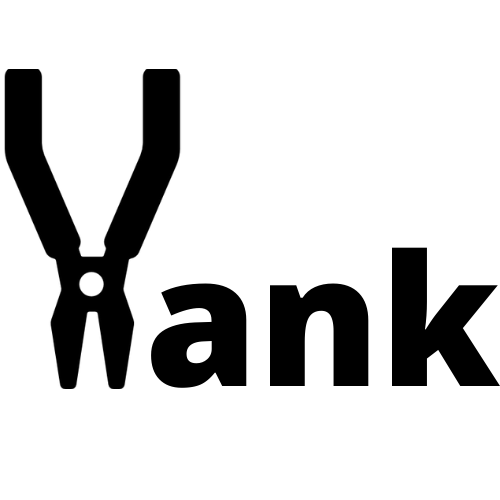

<p align="center">
    
</p>

Yank is a high-level web scraping utility kit for Python 3 and above.

This project is under heavy development and not yet stable. It should not be used in a production environment.

## Installation

You can use the Python Package Index (PyPI) to install Yank.

```
pip install yank
```

## The Yanker Class
```
from yank import Yanker
```

## Getting Started

<details>
<summary>Defining A Yanker</summary>

<br/>

1. Create a class that inherits from Yanker.
2. Specify a start URL as a class attribute, which is used to initiate the first HTTP request.
3. Define a method called "yank" that accepts one argument: target, which is used to access data returned from the completed HTTP request.

```python
# ──────────────────────────────────────────────────────────────────────────────────────
#  QUOTE YANKER                                                                  
# ──────────────────────────────────────────────────────────────────────────────────────

class QuoteYanker(Yanker):
    """ A utility class for yanking quotes from quotes.toscrape.com """

    # ──────────────────────────────────────────────────────────────────────────────────
    #  CLASS ATTRIBUTES
    # ──────────────────────────────────────────────────────────────────────────────────

    # Define start URL
    start_url = "https://quotes.toscrape.com/"

    # Or multiple start URLs to which QuoteYanker.yank() is applied
    # start_urls = ["https://quotes.toscrape.com/"]

    # ──────────────────────────────────────────────────────────────────────────────────
    #  YANK                                                                 
    # ──────────────────────────────────────────────────────────────────────────────────

    def yank(self, target):
        """ Handles a Target object derived from the start URL and its HTTP response """
        
        # Get URL
        url = target.url

        # Get Python requests request object
        request = target.request

        # Get Python requests response object
        response = target.response

        # Get response status code
        status_code = target.status_code

        # Get response raw HTML
        html = target.html

        # Get response bs4 BeautifulSoup object
        soup = target.soup

        # Get response JSON (in the case of API call)
        json = target.json

        # OTHER EXTRACTION LOGIC

        # Return nothing
        return None
```

The above class provides the basic building blocks for your yanker to get started. It will begin by making a GET request to the provided start URL or "target", and then package its corresponding response data and other important information into a Target object. This Target object is then passed into the defined yank method, which executes custom logic -- in this case, a simple demonstration of some of the Target object's more useful attributes.

Of course, none of this will actually happen until the yanker is initialized and run.

</details>

<details>
<summary>Running A Yanker</summary>

<br/>

1. Initialize a yanker instance from your custom Yanker class.
2. Call the yank method on your yanker instance without any arguments; the target object is supplied automagically.

```python
# ──────────────────────────────────────────────────────────────────────────────────────
#  SCRIPT                                                                  
# ──────────────────────────────────────────────────────────────────────────────────────

if __name__ == "__main__":

    # Initialize yanker
    yanker = QuoteYanker()

    # Run yanker
    yanker.yank()
```
```console
[19:33:49] GET https://quotes.toscrape.com/ 200
```

The above script will initialize an instance of the yanker class defined previously, and then run that instance by calling its yank method. A log will appear in your console indicating that an HTTP GET request was made to the start URL, along with the status code of its corresponding response.

</details>

<details>
<summary>Yanking Items</summary>

<br/>

1. Define a method called "yank" that accepts one argument: target.
2. Supply the logic necessary to extract your target's data and yield a dictionary for each distinct item.
3. Supply the logic necessary to follow additional URLs found within the current target page, if any. 

```python
# ──────────────────────────────────────────────────────────────────────────────────────
#  QUOTE YANKER
# ──────────────────────────────────────────────────────────────────────────────────────


class QuoteYanker(Yanker):
    """ A utility class for yanking quotes from quotes.toscrape.com """

    # ──────────────────────────────────────────────────────────────────────────────────
    #  CLASS ATTRIBUTES
    # ──────────────────────────────────────────────────────────────────────────────────

    # Define start URL
    start_url = "https://quotes.toscrape.com/"

    # ──────────────────────────────────────────────────────────────────────────────────
    #  YANK
    # ──────────────────────────────────────────────────────────────────────────────────

    def yank(self, target):
        """ Handles a Target object derived from the start URL and its HTTP response """

        # ──────────────────────────────────────────────────────────────────────────────
        #  YANK LOGIC
        # ──────────────────────────────────────────────────────────────────────────────

        # Get response bs4 BeautifulSoup object
        soup = target.soup

        # Get quote divs
        quote_divs = soup.select("div.quote")

        # Iterate over quote divs
        for quote_div in quote_divs:

            # Get quote
            quote = quote_div.select("span.text")[0].text

            # Get author
            author = quote_div.select("small.author")[0].text

            # Get tags
            tags = [t.text for t in quote_div.select("a.tag")]

            # Yield quote dict
            yield {
                "quote": quote,  # str
                "author": author,  # str
                "tags": tags,  # list of str
            }

        # ──────────────────────────────────────────────────────────────────────────────
        #  NEXT PAGE LOGIC
        # ──────────────────────────────────────────────────────────────────────────────

        # Get pager unordered list
        pager_ul = soup.find("ul", class_="pager")

        # Get next list item
        next_li = pager_ul and pager_ul.find("li", class_="next")

        # Get next page relative path
        next_page_relative_path = next_li and next_li.find("a")["href"]

        # Check if next page relative path is not null
        if next_page_relative_path:

            # Get base URL
            base_url = target.base_url

            # Construct next page URL from base URL and relative path
            next_page_url = self.urljoin(base_url, next_page_relative_path)

            # Call current yank method on the next page
            self.yank(next_page_url)
```

The above yank method will iterate over each element on the target page that represents a single item, and then extract the relevant data from each. Once every item on the target page is packaged into a dictionary and yielded, the current yank method is called recursively on the URL of the next page, if one exists. In this case, the yank method accepts a string URL, which will be converted automagically into a Target object before the same logic is executed once again.

Of course, your yanked items are simply cast into the void until they are stored or written somewhere, which will need to be configured. Additionally, you may choose to clean each item more thoroughly before storage or writing.

</details>

<details>
<summary>Cleaning Yanked Items</summary>

<br/>

1. Define a method called "clean" that accepts two arguments: target and item.
2. Supply the logic necessary to clean the item yielded from the yank method.
3. Return the cleaned item.

```python
# ──────────────────────────────────────────────────────────────────────────────────────
#  QUOTE YANKER
# ──────────────────────────────────────────────────────────────────────────────────────


class QuoteYanker(Yanker):
    """ A utility class for yanking quotes from quotes.toscrape.com """

    # ──────────────────────────────────────────────────────────────────────────────────
    #  CLASS ATTRIBUTES
    # ──────────────────────────────────────────────────────────────────────────────────

    # Define start URL
    start_url = "https://quotes.toscrape.com/"

    # ──────────────────────────────────────────────────────────────────────────────────
    #  YANK
    # ──────────────────────────────────────────────────────────────────────────────────

    def yank(self, target):
        """ Handles a Target object derived from the start URL and its HTTP response """

        # YANK LOGIC

        # Yield item
        yield item  # dict

    # ──────────────────────────────────────────────────────────────────────────────────
    #  CLEAN
    # ──────────────────────────────────────────────────────────────────────────────────

    def clean(self, target, item):
        """ Cleans an item dictionary yielded by the corresponding yank method """

        # Convert tags from a list of strings to a single comma-separated string
        item["tags"] = ",".join(item["tags"])

        # Return item
        return item  # dict
```

The above clean method receives the same target argument supplied in the previous yank method, plus an item dictionary. In other words, this clean method will be called on each item yielded from the corresponding yank method.

Of course, cleaning can be handled directly within the yank method if you wish to omit the clean method altogether. However, a separate clean method is useful in cases that warrant a greater separation of concerns, particularly if complex logic is involved.

</details>

<details>
<summary>Storing Yanked Items: Interface</summary>

<br/>

1. Apply a Yanker.interface decorator to the yank method.
2. Supply keyword arguments that correspond to column name and value type. 

```python
# ──────────────────────────────────────────────────────────────────────────────────────
#  QUOTE YANKER
# ──────────────────────────────────────────────────────────────────────────────────────


class QuoteYanker(Yanker):
    """ A utility class for yanking quotes from quotes.toscrape.com """

    # ──────────────────────────────────────────────────────────────────────────────────
    #  CLASS ATTRIBUTES
    # ──────────────────────────────────────────────────────────────────────────────────

    # Define start URL
    start_url = "https://quotes.toscrape.com/"

    # ──────────────────────────────────────────────────────────────────────────────────
    #  YANK
    # ──────────────────────────────────────────────────────────────────────────────────

    @Yanker.interface(
        quote=str,
        author=str,
        tags=str,
    )
    def yank(self, target):
        """ Handles a Target object derived from the start URL and its HTTP response """

        # ──────────────────────────────────────────────────────────────────────────────
        #  YANK LOGIC
        # ──────────────────────────────────────────────────────────────────────────────

        # Get response bs4 BeautifulSoup object
        soup = target.soup

        # Get quote divs
        quote_divs = soup.select("div.quote")

        # Iterate over quote divs
        for quote_div in quote_divs:

            # Get quote
            quote = quote_div.select("span.text")[0].text

            # Get author
            author = quote_div.select("small.author")[0].text

            # Get tags
            tags = [t.text for t in quote_div.select("a.tag")]

            # Yield quote dict
            yield {
                "quote": quote,  # str
                "author": author,  # str
                "tags": tags,  # list of str
            }
```

The above Yanker.interface decorator instructs your yanker to save each item yielded by the decorated yank method as a row in a table. You may have noticed an SQLite .db file appearing in your working directory upon running the yanker. This is where your tables will live, and their schema will be automatically generated upon declaration of this interface.

The keyword arguments supplied to your interface correspond to the name of a column and Python type -- or "cast" -- of the value it's meant to store. For example, `quote=str` establishes an explicit directive that the value for "quote" on all items yielded from the yank method must be castable to a Python string prior to being stored in the database.

Currently supported interface casts include:

- String (str)
- Integer (int)
- Float (float)
- Boolean (bool)
- Datetime (datetime)

</details>

<details>
<summary><strong>Storing Yanked Items: Interface Options</strong></summary>

<br/>

1. Convert the righthand side of each interface keyword into a dictionary.
2. Add additional options to each dictionary if necessary. 

```python
# Shorthand
@Yanker.interface(
    quote=str,
    author=str,
    tags=str,
)

# Longhand
@Yanker.interface(
    quote={"cast": str, "unique": True},
    author={"cast": str},
    tags={"cast": str},
)
```

The above snippet demonstrates a shorthand and longhand version of the same interface declaration. The shorthand version expects a column name on the left side and a cast on the right side. The longhand version expects a dictionary on the right side that contains at least the cast specification .

Currently supported interface options include:

- unique: bool = False
    - Whether or not any other rows (items) in the table can share the same value for this column.
- null: bool = False
    - Whether or not the value can be None. Note that "nullish" values such as empty strings are still allowed.

</details>

<details>
<summary>Reading Yanked Items</summary>

[...]

</details>

<details>
<summary>Writing Yanked Items</summary>

[...]

</details>

## Roadmap

The following is a list of pending features presented in order of priority:

- [...]
- Writing Files
- History Tracking
- Item Relationships
- Database Migrations
- Remote Databases
- [...]

## FAQ

- [...]

